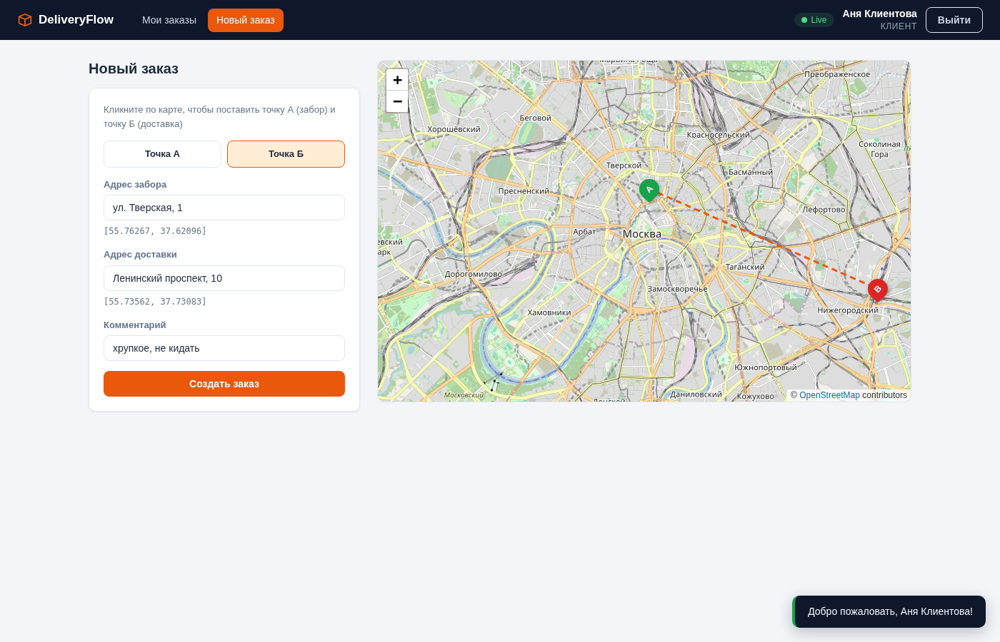
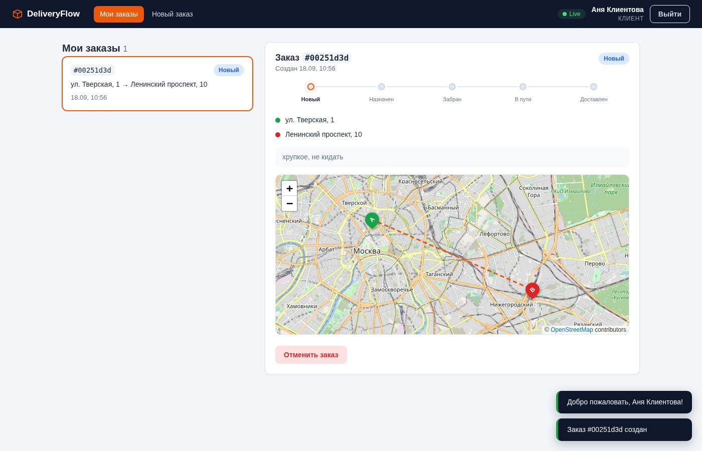
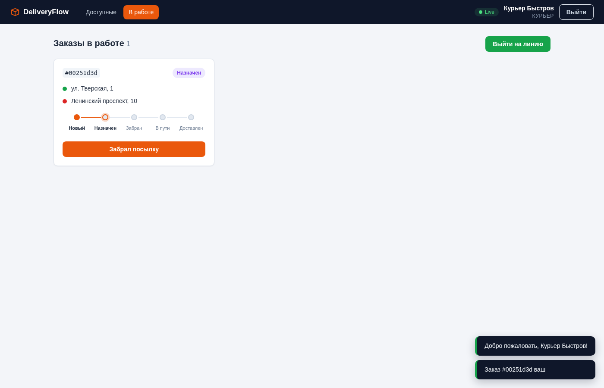
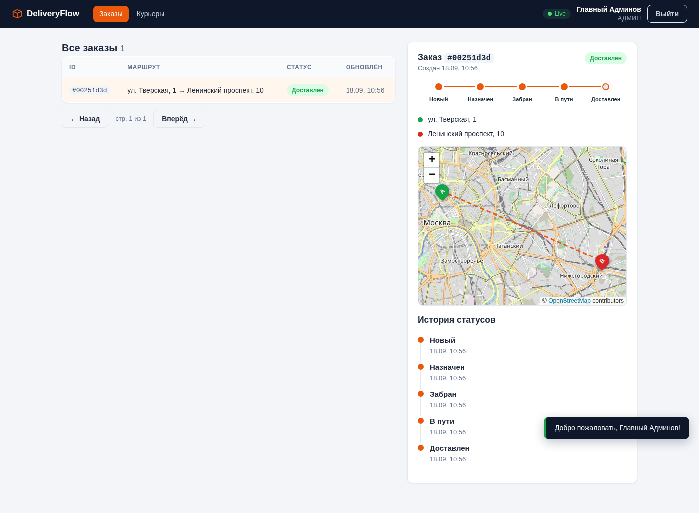

# DeliveryFlow

Система управления доставкой в реальном времени: клиенты создают заказы, курьеры их забирают и транслируют своё местоположение, админ видит всё происходящее. Бэкенд на Java 21, веб-клиент — без фреймворков.

**Java 21 · Spring Boot 3.3 · Kafka · Redis · PostgreSQL · WebSocket · Leaflet**

## Что здесь интересного

- **Событийная архитектура**: заказы и локации идут через Kafka, консьюмеры разливают события в WebSocket — клиент видит движение курьера на карте в реальном времени
- **Redis Geo** для хранения координат курьеров, **Redisson** для распределённых блокировок на переходах статусов (два курьера не смогут перехватить один заказ)
- **Виртуальные потоки** (Project Loom) включены одной строкой конфига
- **Веб-клиент на чистом JS** — без React/Vue/сборки: hash-роутер, STOMP-клиент и работа с fetch написаны руками, чтобы показать, как это устроено под капотом фреймворков
- **JWT с refresh-токенами**: клиент молча обновляет пару токенов при 401 и повторяет запрос
- **Валидатор конечного автомата статусов**: CREATED → ASSIGNED → PICKED_UP → IN_TRANSIT → DELIVERED, отменить можно только пока заказ не забран

## Скриншоты

Создание заказа — точки А и Б ставятся кликом по карте:



Клиент следит за заказом: степпер статусов и карта с маршрутом (курьерская метка двигается по WebSocket):



Курьер: приём заказа, кнопки переходов по статусам, кнопка «Выйти на линию» запускает передачу координат:



Админ: все заказы с пагинацией, история статусов и карта:



## Архитектура

```
Клиент (SPA) ──REST──►  Spring Boot API ──►  PostgreSQL
     ▲                       │    │
     │                       ▼    ▼
     │                    Kafka   Redis (Geo + Locks)
     │                       │
     └────WebSocket (STOMP)──┤
                             ▼
                   Consumers: location → Redis Geo → WS,
                              status → WS, order → WS
```

Поток события локации: `POST /courier/location` → Kafka `courier.location-updated` → consumer пишет точку в Redis Geo и ретранслирует в `/topic/courier/{id}/location` → карта у клиента двигает маркер.

## Роли

| Роль | Возможности |
|------|-------------|
| CLIENT | Создание заказов (точки кликом по карте), отслеживание с живой картой, отмена |
| COURIER | Лента доступных заказов (пополняется сама), принятие, смена статусов, трансляция геолокации |
| ADMIN | Все заказы с пагинацией, история статусов, список курьеров, live-карта |

## Как посмотреть демо

```bash
docker compose up -d          # поднимет всю инфраструктуру + бэкенд + фронт
# открыть http://localhost:8088
```

Дальше — самый наглядный сценарий, три окна браузера:

1. В первом окне зарегистрируйтесь как **Клиент**, во втором — как **Курьер**, в третьем — как **Админ**
2. Клиент: «Новый заказ» → поставьте точки А и Б кликами по карте → «Создать заказ»
3. Курьер: во вкладке «Доступные» заказ появится сам (toast «Появился новый заказ») → «Взять заказ» → «Выйти на линию» — курьер начнёт передавать координаты каждые 3 секунды
4. Клиент: откройте заказ — синяя метка курьера движется по карте, статусы обновляются сами
5. Курьер: «Забрал посылку» → «Выехал к клиенту» → «Доставлен» — у клиента и админа всё меняется в реальном времени
6. Админ: клик по заказу в таблице — история всех переходов статусов с таймингами

## Запуск для разработки

Инфраструктура отдельно, бэкенд и фронт — локально:

```bash
docker compose up -d postgres redis kafka zookeeper
./gradlew bootRun             # API на :8080

cd frontend
python3 -m http.server 8000   # фронт на :8000 (CORS на бэкенде уже открыт)
```

Метрики: Prometheus `:9090`, Grafana `:3000` (admin/admin), Kafka UI `:8090`.

## Структура проекта

```
├── src/main/java/com/deliveryflow/
│   ├── api/            # контроллеры, DTO, обработка исключений
│   ├── config/         # security (JWT), Kafka, Redis, WebSocket
│   ├── domain/         # сущности, репозитории, enum статусов
│   ├── infrastructure/ # Redis Geo, распределённые блокировки, WS-рассылка
│   ├── mapper/         # MapStruct
│   ├── messaging/      # Kafka продюсеры/консьюмеры, события
│   ├── security/       # JWT-провайдер, фильтр
│   └── service/        # бизнес-логика
├── frontend/           # SPA-клиент (подробнее — frontend/README.md)
├── docs/screenshots/
├── docker-compose.yml  # postgres, redis, kafka, backend, nginx-фронт, мониторинг
└── Dockerfile          # multi-stage: сборка gradle → slim JRE
```

## API

### Authentication
- `POST /api/v1/auth/register` — регистрация (email, пароль, имя, роль)
- `POST /api/v1/auth/login` — вход
- `POST /api/v1/auth/refresh` — обновление пары токенов

### Orders (CLIENT)
- `POST /api/v1/orders` — создать заказ
- `GET /api/v1/orders/{id}` — получить заказ
- `GET /api/v1/orders/me` — мои заказы
- `DELETE /api/v1/orders/{id}` — отменить

### Courier (COURIER)
- `GET /api/v1/courier/orders/available` — свободные заказы
- `GET /api/v1/courier/orders/active` — заказы в работе
- `PATCH /api/v1/courier/orders/{id}/accept` — взять заказ
- `PATCH /api/v1/courier/orders/{id}/status` — сменить статус
- `POST /api/v1/courier/location` — передать координаты

### Admin (ADMIN)
- `GET /api/v1/admin/orders?page=&size=` — все заказы (Spring Page)
- `GET /api/v1/admin/couriers` — курьеры
- `GET /api/v1/admin/orders/{id}/history` — история статусов

### WebSocket (STOMP over SockJS, endpoint `/ws`)

| Топик | Что приходит |
|-------|--------------|
| `/topic/orders/{id}/status` | смена статуса заказа |
| `/topic/courier/{id}/location` | новые координаты курьера |
| `/topic/orders/available` | новый заказ для курьеров |

## Статусы заказа

```
CREATED → ASSIGNED → PICKED_UP → IN_TRANSIT → DELIVERED
   └────────┴─→ CANCELLED
```

Переходы валидируются автоматом; конкурентные смены статуса сериализуются распределённой блокировкой Redisson по id заказа.

## Тестирование

```bash
./gradlew test              # unit-тесты OrderService
./gradlew integrationTest   # интеграционные с Testcontainers
```

## Известные компромиссы

Честный список того, что в продакшене сделал бы иначе:

- **JWT в localStorage** — уязвим к XSS; по-взрослому это HttpOnly cookie + CSRF-защита
- **Simple broker вместо RabbitMQ/STOMP-брокера** — нет адресации на конкретного пользователя, поэтому клиент подписывается на топики своих заказов поэлементно
- **Курьерский «GPS» — симулятор** (движение между точками А и Б), чтобы демо работало без телефона; заменяется на `navigator.geolocation` одной функцией
- **Тайлинг карты ходит на OSM** — для продакшена нужен свой провайдер тайлов
- **Refresh-токены не имеют server-side отзыва** — при компрометации остаётся ждать истечения

## Лицензия

MIT
